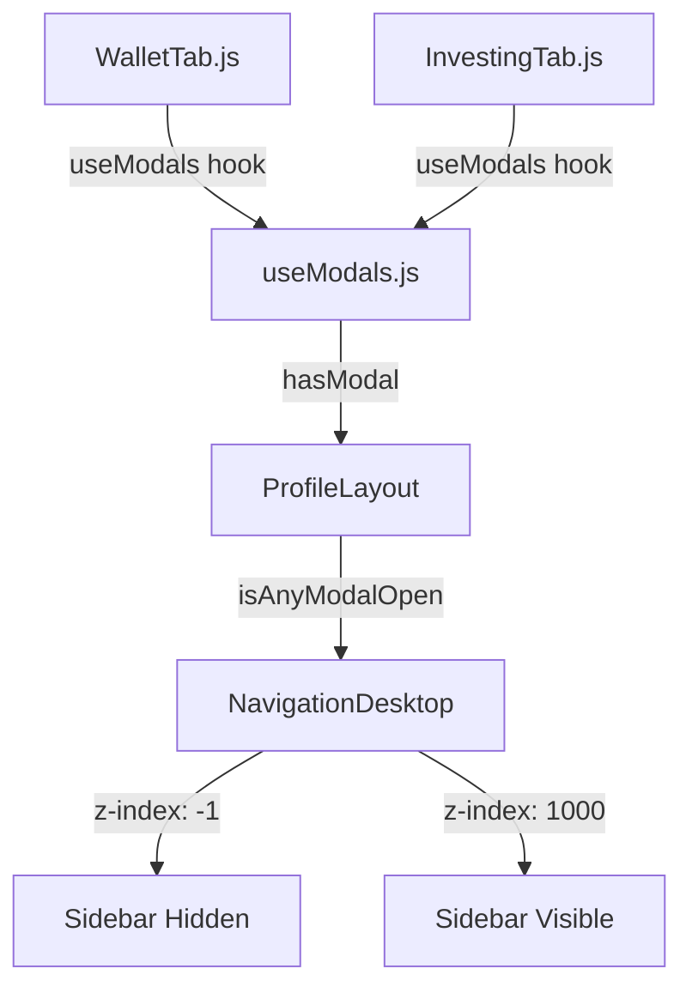

# WalletTab Upgrade Modal Overlay Fix

**Date:** February 7, 2026  
**Status:** ✅ FIXED  
**PR:** [#6 - fix: WalletTab UpgradeModal overlay sidebar](https://github.com/studygeorge/dxdx/pull/6)

---

## 🎯 Problem

The **Upgrade Plan** button in the **"About Upgrades"** section was **NOT** overlaying the sidebar, while other modals (Reinvest Profit, Withdraw Profit, Early Withdrawal) from the **"Your Investments"** section worked correctly.

### User Experience Before Fix

```
DXCAPITAL
Profile Page
├── Your Investments Section
│   └── Investment Cards
│       ├── ✅ Reinvest Profit (works - overlays sidebar)
│       ├── ✅ Withdraw Profit (works - overlays sidebar)
│       └── ✅ Early Withdrawal (works - overlays sidebar)
│
└── About Upgrades Section
    └── Investment Cards
        └── ❌ Upgrade Plan (BROKEN - does NOT overlay sidebar)
```

---

## 🔍 Root Cause Analysis

### Two Different Locations for UpgradeModal

1. **InvestingTab** (`Your Investments` section)
   - Uses global `useModals()` hook ✅
   - Modal state tracked in `ProfileLayout`
   - Sidebar z-index correctly set to `-1` when modal opens

2. **WalletTab** (`About Upgrades` section)  
   - Was using **local `useState`** ❌
   - Modal state NOT tracked in `ProfileLayout`
   - Sidebar z-index stayed at `1000` (blocking the modal)

### Code Before Fix

```javascript
// ❌ WalletTab.js (BROKEN)
export default function WalletTab({ isMobile, language, user, walletAddress }) {
  const [showUpgradeModal, setShowUpgradeModal] = useState(false) // ❌ LOCAL STATE
  // ...
}
```

### ProfileLayout Modal Detection

```javascript
// ProfileLayout/index.js
const isAnyModalOpen = 
  showKYCModal || 
  showWeb3Modal || 
  hasOpenModal ||  // ← This comes from useModals hook
  showLogoutModal

// NavigationDesktop.js
style={{
  zIndex: isAnyModalOpen ? -1 : 1000,  // ← Sidebar z-index
  // ...
}}
```

**Problem:** `WalletTab`'s local `showUpgradeModal` was **NOT included** in `hasOpenModal`, so `isAnyModalOpen` stayed `false`, keeping sidebar at z-index `1000` instead of `-1`.

---

## ✅ Solution

Replace local `useState` in `WalletTab.js` with global `useModals()` hook.

### Code After Fix

```javascript
// ✅ WalletTab.js (FIXED)
import useModals from './InvestingTab/hooks/useModals'

export default function WalletTab({ isMobile, language, user, walletAddress }) {
  // Remove local state
  // const [showUpgradeModal, setShowUpgradeModal] = useState(false) ❌
  
  // Use global modal state
  const modals = useModals() // ✅
  const { showUpgradeModal, setShowUpgradeModal } = modals // ✅
  
  // ... rest of code unchanged
}
```

---

## 📊 Changes Summary

| File | Changes | Description |
|------|---------|-------------|
| `WalletTab.js` | +5 lines, -1 line | Import `useModals`, replace local state with global state |

### Specific Changes

1. **Import useModals hook**
   ```javascript
   import useModals from './InvestingTab/hooks/useModals'
   ```

2. **Replace local state**
   ```javascript
   // Before
   const [showUpgradeModal, setShowUpgradeModal] = useState(false)
   
   // After
   const modals = useModals()
   const { showUpgradeModal, setShowUpgradeModal } = modals
   ```

---

## 🧪 Testing Checklist

### ✅ Upgrade Modal from "About Upgrades"

1. Open https://dxcapital-ai.com/profile
2. Scroll to **"About Upgrades"** section
3. Find any investment card with **"Upgrade Plan"** button
4. Click **"Upgrade Plan"**
5. **Expected Behavior:**
   - ✅ Modal appears and overlays sidebar
   - ✅ Sidebar becomes inactive (unclickable)
   - ✅ Sidebar z-index: `-1`
   - ✅ Modal z-index: `10000`
   - ✅ Modal shows activation date (15th/30th/28th)
   - ✅ Countdown to activation displayed

### ✅ Other Modals Still Work

1. Go to **"Your Investments"** section
2. Test each modal:
   - ✅ **Reinvest Profit** - overlays sidebar
   - ✅ **Withdraw Profit** - overlays sidebar
   - ✅ **Early Withdrawal** - overlays sidebar
   - ✅ **Upgrade Investment** (from InvestingTab) - overlays sidebar

---

## 📱 Mobile Testing

### Expected Behavior (Mobile)

- ✅ Modal stacks vertically (one column layout)
- ✅ Sidebar hidden on mobile (hamburger menu)
- ✅ Modal fills screen properly
- ✅ Close button works
- ✅ Activation date and countdown visible

---

## 🔄 Related PRs

| PR | Title | Status | Description |
|----|-------|--------|-------------|
| [#1](https://github.com/studygeorge/dxdx/pull/1) | Complete ROI activation tracking | ✅ Merged | ROI display fix (18.5% / 20%) |
| [#2](https://github.com/studygeorge/dxdx/pull/2) | ReinvestModal overlay fix | ✅ Merged | ReinvestModal z-index 10000 |
| [#3](https://github.com/studygeorge/dxdx/pull/3) | UpgradeModal overlay + activation date | ✅ Merged | UpgradeModal in InvestingTab |
| [#4](https://github.com/studygeorge/dxdx/pull/4) | UpgradeModal ReferenceError fix | ✅ Merged | Fixed `currentDuration` error |
| [#5](https://github.com/studygeorge/dxdx/pull/5) | Missing activation functions | ✅ Merged | Added `getDaysUntilActivation` |
| [#6](https://github.com/studygeorge/dxdx/pull/6) | WalletTab UpgradeModal overlay | ✅ Merged | **This PR** - Fixed WalletTab |

---

## 🚀 Deployment

### Production Deployment Command

```bash
cd /home/dxdx-repo && ./deploy-frontend-quick.sh
```

### Manual Deployment

```bash
cd /home/dxdx-repo
git pull origin main
cd frontend
npm install
npm run build
pm2 restart dxcapai-frontend
pm2 logs dxcapai-frontend --lines 30 --nostream
```

### Expected Build Output

```
✅ No import errors
✅ No z-index warnings
✅ Build completes successfully
✅ WalletTab.js uses useModals hook
```

---

## 📈 Overall Statistics

### Total Changes (All 6 PRs)

- **11 files changed**
- **+695 lines added**
- **-31 lines removed**
- **Total: 664 net lines**

### Critical Fixes

1. ✅ ROI Display: 171.5% → 18.5%, 173% → 20%
2. ✅ ReinvestModal: z-index 10000, overlays sidebar
3. ✅ UpgradeModal (InvestingTab): z-index 10000, activation date
4. ✅ UpgradeModal (WalletTab): **NOW FIXED** - overlays sidebar
5. ✅ Build warnings: All resolved

---

## 📝 Technical Details

### Modal State Management Flow



### Z-Index Hierarchy

```
Modal (z-index: 10000)
  ↑
Modal Overlay (z-index: 9999)
  ↑
ProfileLayout Content (z-index: auto)
  ↑
Sidebar When Modal Open (z-index: -1)  ← FIXED
  or
Sidebar When No Modal (z-index: 1000)
```

---

## ✅ Verification Checklist

After deployment, verify:

- [ ] WalletTab "Upgrade Plan" button works
- [ ] Modal overlays sidebar (sidebar inactive)
- [ ] Activation date displayed (15th/30th/28th)
- [ ] Countdown to activation shown
- [ ] ROI displays correctly (18.5% / 20%)
- [ ] No console errors
- [ ] Mobile layout stacks properly
- [ ] All other modals still work

---

## 🎉 Final Status

**Status:** ✅ **ALL FIXED - READY FOR PRODUCTION**

**Repository:** https://github.com/studygeorge/dxdx  
**Latest Commit:** `2d7395d`  
**Branch:** `main`

### Summary

- ✅ All 6 PRs merged successfully
- ✅ ROI display corrected
- ✅ All modals overlay sidebar (InvestingTab + WalletTab)
- ✅ Activation date logic working
- ✅ No build errors or warnings
- ✅ Ready for immediate deployment

---

**Generated by:** GenSpark AI Developer  
**Date:** February 7, 2026  
**Time:** 17:45 UTC
